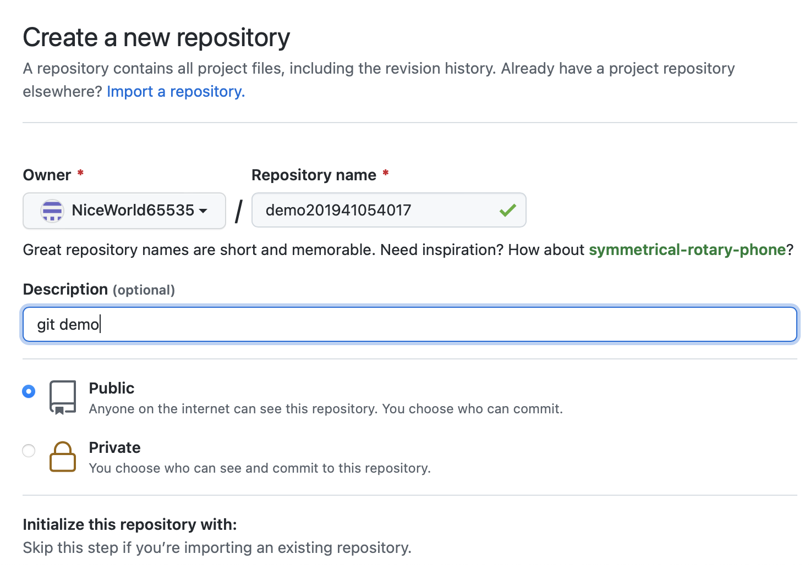
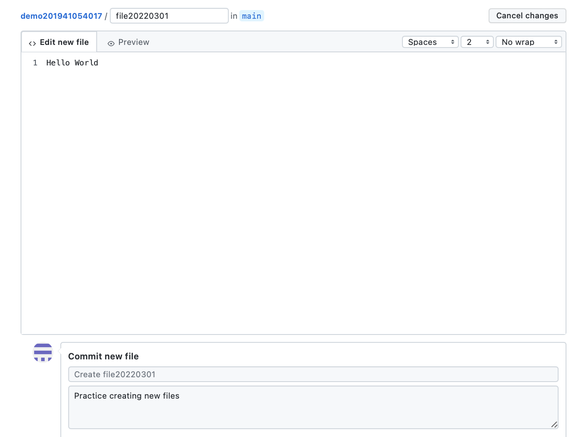
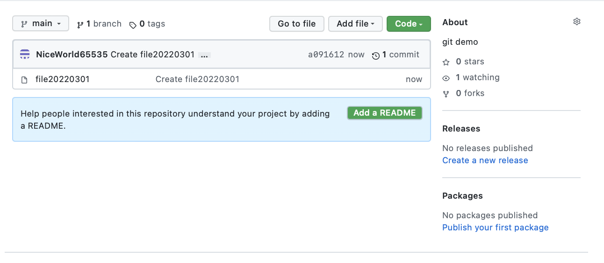
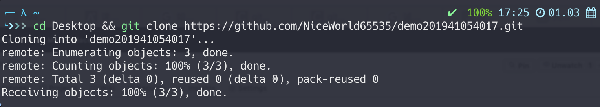
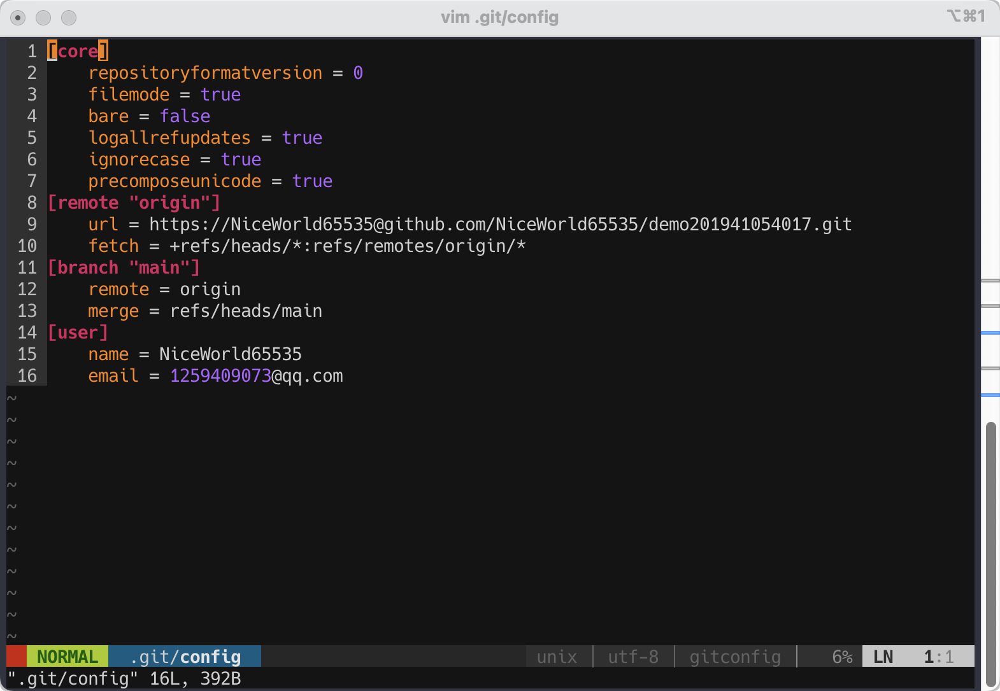
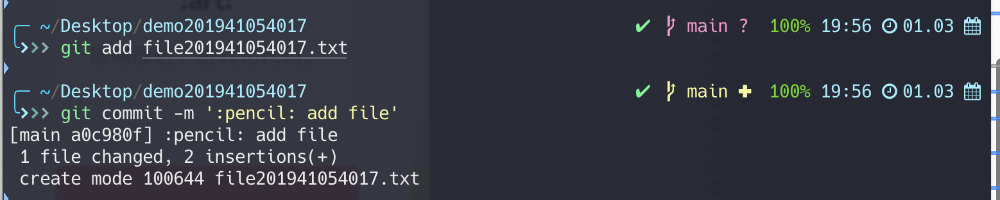
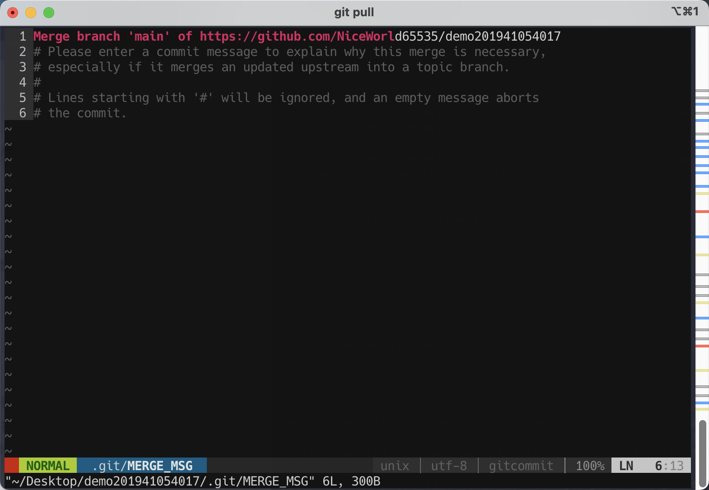
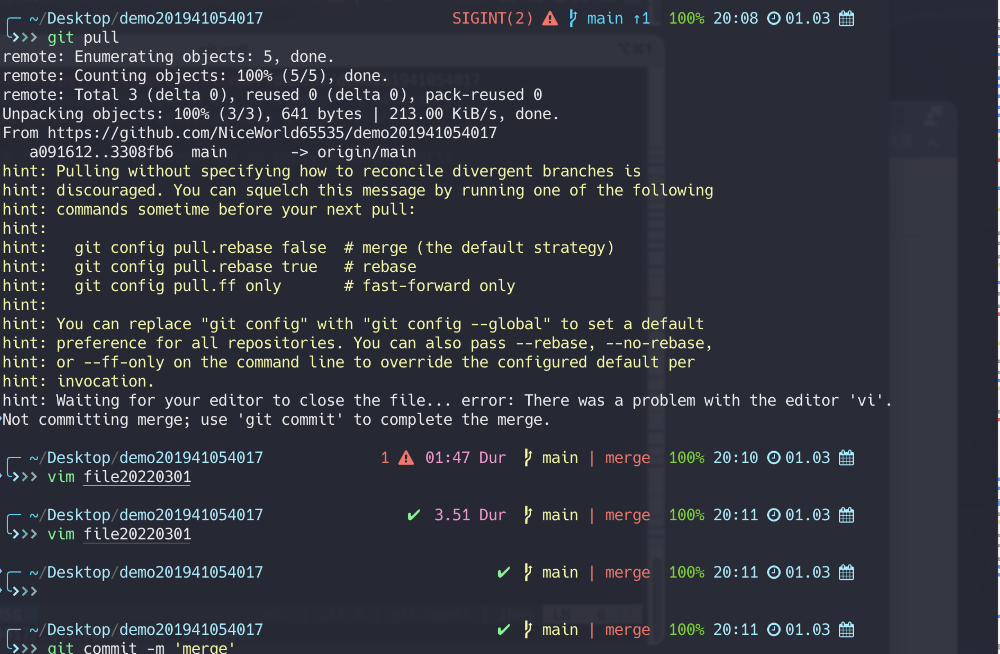

 <div align='center' ><font size='40px'>实验一 Git工具的使用</font></div>

---

1. 安装Git工具

2.  注册GitHub用户

3. 创建新库。名称为：demo+学号，如：demo2001010203。截图，贴于报告中

   

4. 在新库中创建新的文件，文件名称为：file+日期，如：file20220301

5.  提交该变更至main分支，记得填写提交信息

   

6. 截图当前的Repository——Code页，贴于报告中

   

7. 使用Git工具将该库Clone到本地。将结果截图贴于报告中

   ```shell
   cd Desktop && git clone {YOUR_GIT_RUL}
   ```

   ​	

8. 在本地克隆仓库中创建文件，文件名为：file+学号，如file2001010203.txt

   ```shell
   cd demo201941054017 && vim file201941054017.txt
   ```

9. 编辑file2001010203.txt文件，在里面输入个人信息：学号、姓名

10. 添加文件file2001010203.txt到仓库，并提交变化到GitHub。记得设置邮箱和名字。

    ```shell
    vim .git/config
    ```

    

11. 截图当前的Repository——Code页，贴于报告中。

12. 在GitHub中修改file2001010203.txt文件，内容随意。

13. 在本地修改file2001010203.txt文件，内容随意。提交该变化至服务器

    ```shell
    git add file201941054017.txt && git commit -m ':pencil: add file'
    ```

    

14. 展示冲突。截图贴于报告中

    ```shell
    git push -u origin main
    ```

    

    

15. 解决冲突，提交文件至GitHub

    ```shell
    git pull
    vim file20220301
    git commit -m 'merge'
    git push
    ```

    

    