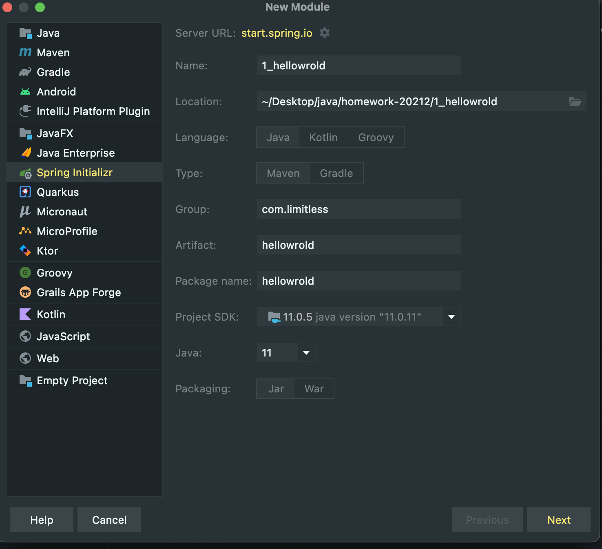
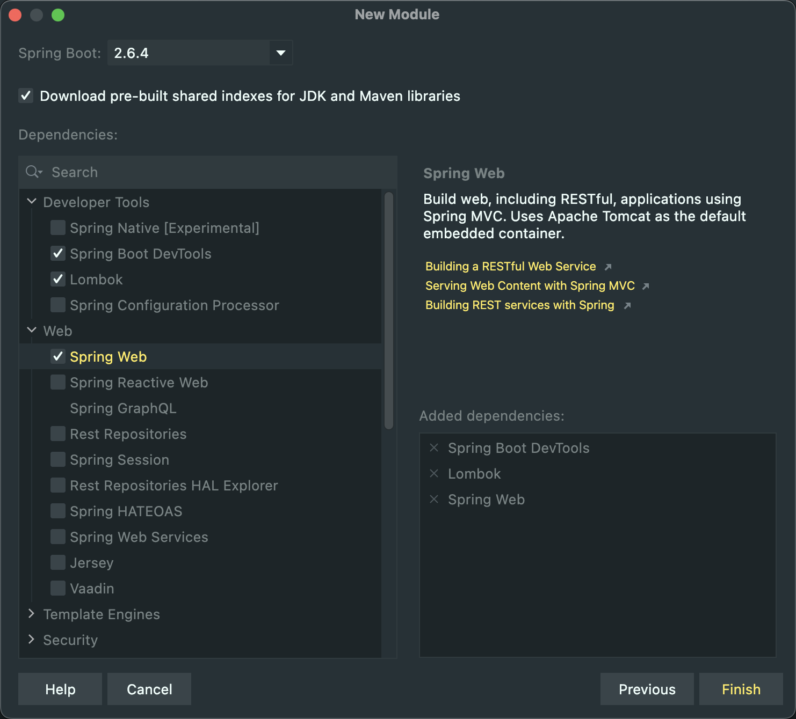
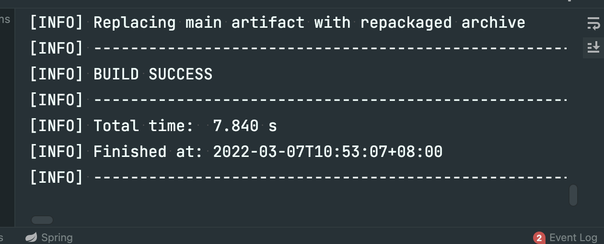
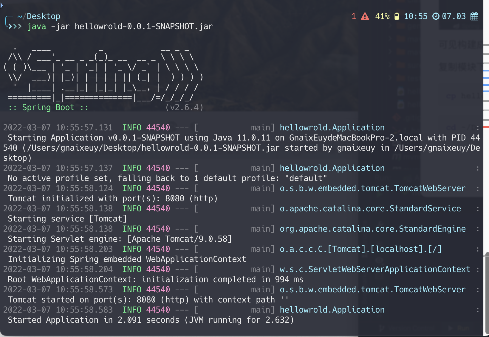
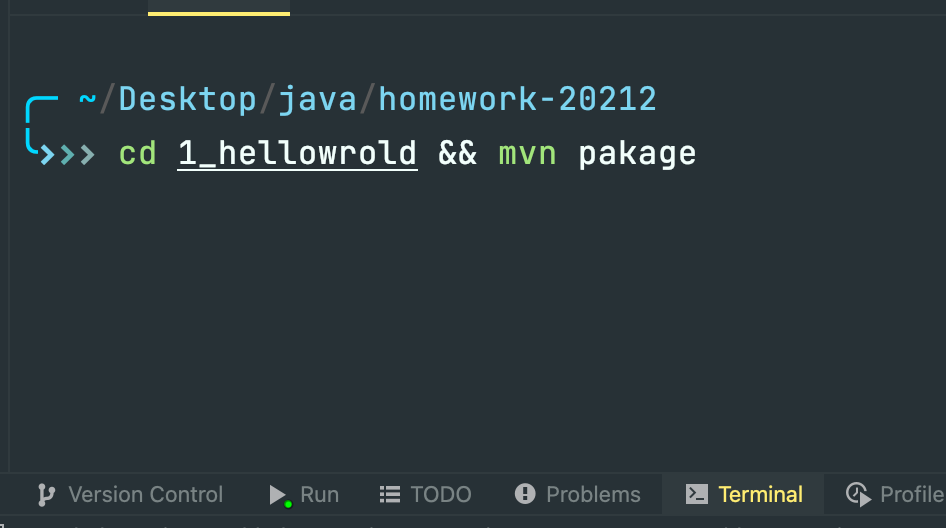
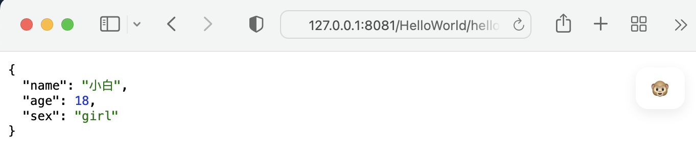

### 练习：

> **按照SpringBoot 讲义内容，从头跟着课上内容的讲解或录屏边做边理解**

---

* 使用 SpringBoot 架构完成 HelloWord案例

  



```java
package hellowrold.controller;

import org.springframework.web.bind.annotation.GetMapping;
import org.springframework.web.bind.annotation.RequestMapping;
import org.springframework.web.bind.annotation.RestController;

/**
 * 
 *
 * @author GnaixEuy
 * @date 2022/3/7
 * @see <a href='https://github.com/GnaixEuy'> GnaixEuy的GitHub </a>
 */
@RestController
@RequestMapping(value = {"/hello"})
public class HelloController {

	@GetMapping(value = {""})
	public String sayHello(){
		return "Hello World";
	}

}

```

创建Hello Controller

---

* 打包HelloWorld案例，用命令行启动Jar包

  

> 可使用maven 插件直接package打包 或使用 mvn 命令

1. maven 插件点击：

​	

可见构建成功

复制模块下 target内打包好的jar 包 到桌面

```shell
cp hellowrold-0.0.1-SNAPSHOT.jar ~/Desktop/
```

```shell
cd ~/Desktop && java -jar hellowrold-0.0.1-SNAPSHOT.jar
```



2. mvn 方式：

   

   ``` shell
    cd 1_hellowrold && mvn pakage
   ```

   打开内置terminal 并执行上述命令打包

   可见同build success即打包成功

---

* 修改配置文件，让项目端口号变为 8081，以及访问路径上添加“项目名称”

  在resource下创建 application.yml 使用yaml 来进行SpringBoot配置文件的编写

  ```yaml
  server:
    port: 8081
    servlet:
      context-path: /HelloWorld
  ```

> 访问 127.0.0.1:8081/HelloWorld/hello 来查看是否成功

---

* 使用@Value 获取配置文件中的自定义配置项

  ```java
  package hellowrold.Vo;
  
  import lombok.AllArgsConstructor;
  import lombok.Data;
  import lombok.NoArgsConstructor;
  import lombok.ToString;
  import org.springframework.beans.factory.annotation.Value;
  import org.springframework.stereotype.Component;
  
  /**
   * 
   *
   * @author GnaixEuy
   * @date 2022/3/7
   * @see <a href='https://github.com/GnaixEuy'> GnaixEuy的GitHub </a>
   */
  @Data
  @NoArgsConstructor
  @AllArgsConstructor
  @ToString
  @Component
  public class PersonVo {
  
  	@Value("${person.name}")
  	private String name;
  	@Value("${person.age}")
  	private Integer age;
  	@Value("${person.sex}")
  	private String sex;
  
  }
  ```

  创建Vo包和PersonVo 使用Lombok 自动生成javabean 代码

  在 HelloController中补充访问PersonVo的接口

  ```java
  @Autowired
  	private PersonVo personVo;
  
  @GetMapping(value = {"/person"})
  	public PersonVo whoAmI(){
  		return this.personVo;
  	}
  ```

  > 访问 http://127.0.0.1:8081/HelloWorld/hello/person 验证是否成功

  

---

完成本次实验