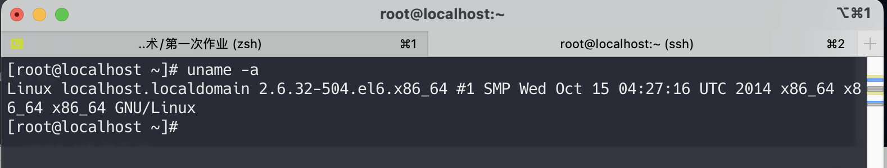
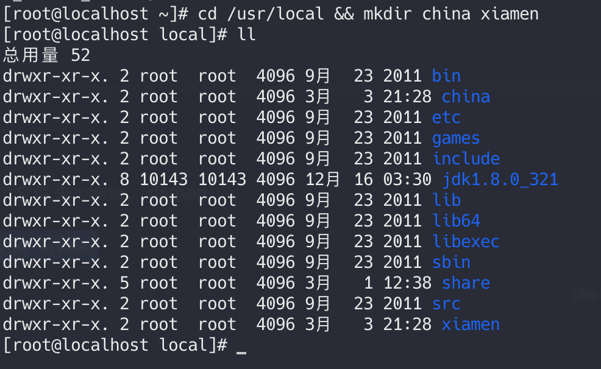
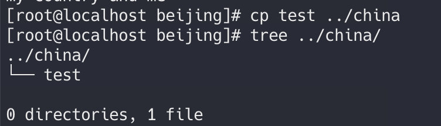

实验一：按照以下步骤安装Linux

	1. 安装虚拟机软件VMWare WorkStation 8。
	1.  配置虚拟机硬件环境。
	1.  利用CentOS6.4镜像光盘，安装CentOS6.4操作系统。
	1. 检查和配置CentOS6.4系统。

---



---

### 实验二： Linux常用命令

1. 切换到/usr/local文件夹下，新建两个文件夹 china，xiamen

   ```shell
   cd /usr/local && mkdir china xiamen
   ```

   

2. 将xiamen文件夹重命名beijing

    ```shell
    mv xiamen beijing
    ```

3. 添加一个文件test到beijing文件夹中

   ```shell
   cd beijing && touch test
   ```

   

4. 往test文件中添加一行话，”my country and me”，并保存  vi gedit

   ```shell
   vim test
   ```

5. 在终端中输出（查看）test文件中的内容

   ```shell
   cat test
   ```

6. 将test文件复制到china文件夹中

   ```shell
   cp test ../china
   ```

   

7. 问询后删除beijing文件夹中的test文件

   ```shell
   rm test
   ```

8. 显示china文件夹下的test文件的详细信息

   ``` shell
   cd ../china && ll -a
   ```

9. 在china文件夹下创建一个权限753的文件夹town

   ```shell
   mkdir -m 753 town
   ```

10. 将town文件夹剪切到/usr/local目录下

    ```shell
    mv town/ /usr/local/
    ```

