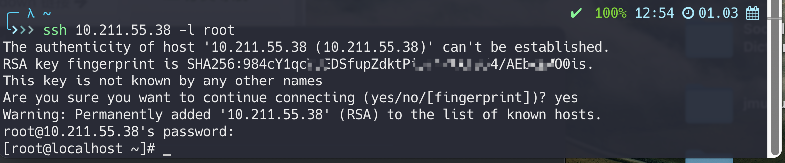
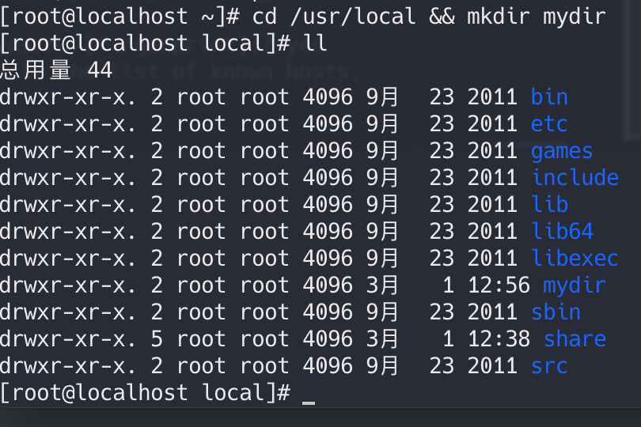
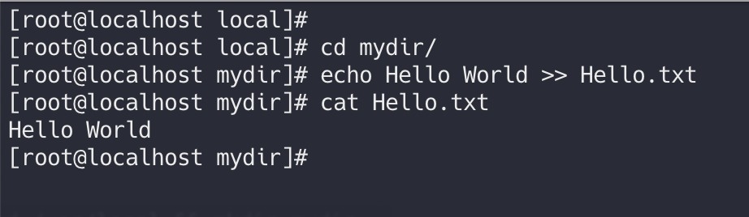
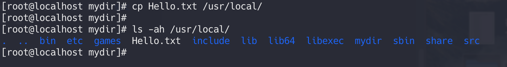
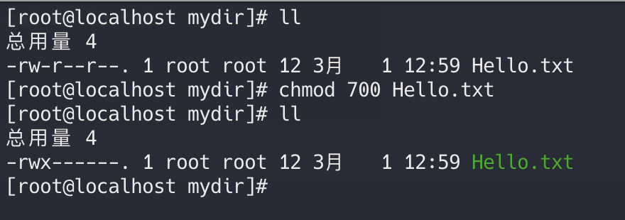
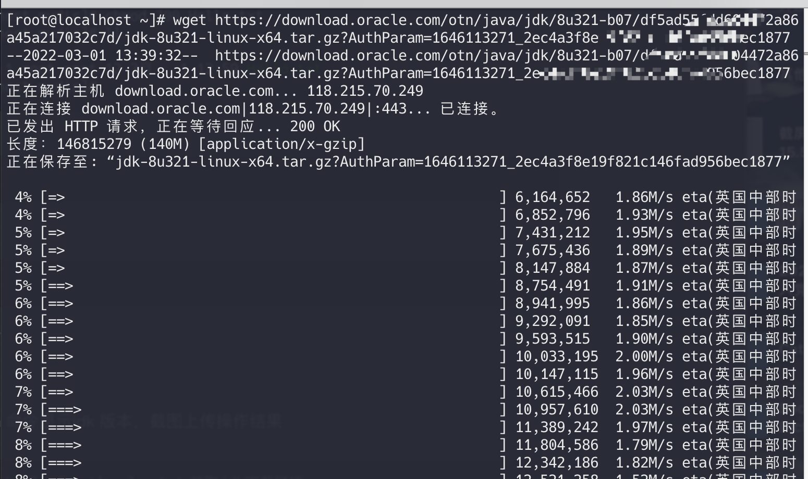
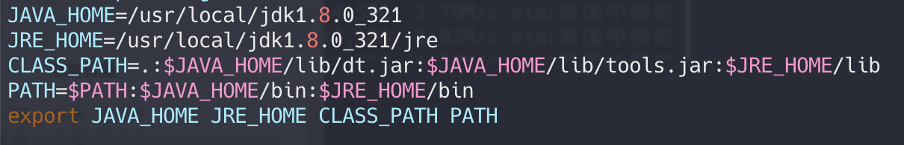
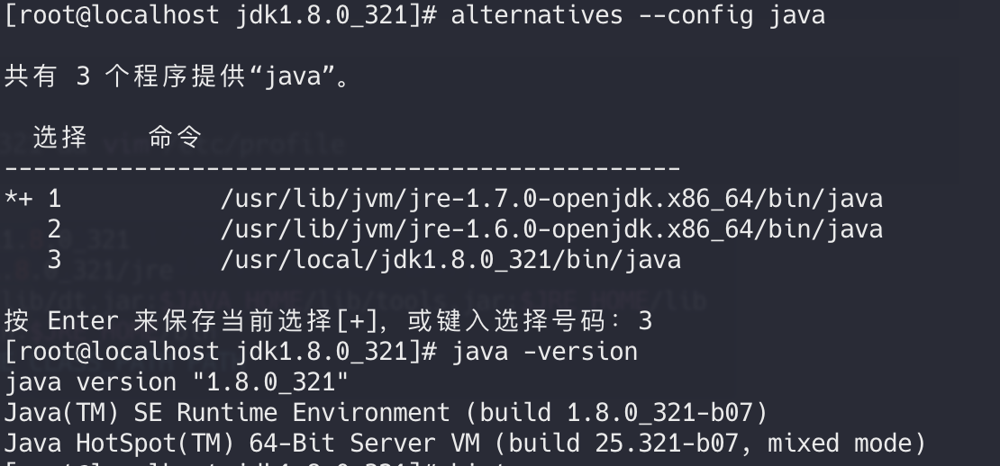

## 第一次作业

---

#### 连接实验环境：

​	

#### 作业1：

1. 在"/usr/local"目录中创建文件夹"mydir"

   ```shell
   cd /usr/local && mkdir mydir
   ```

   

   

2. 在"mydir”文件夹下创建文件"Hello.txt”

3. 在该文件中填入"Hello World”内容

   ```shell
   cd mydir
   echo Hello World >> Hello.txt
   cat Hello.txt
   ```

   

   

4. 将"Hello.txt"'文件拷贝到“/usr/local”目录中

   ```shell
   cp Hello.txt /usr/local/
   ls -ah /usr/local
   ```

   

---

#### 作业2:

指定一个文件的权限为：<请用8进制表示这组权限>

1. 自己拥有读写执行权限

   ```shell
   ll
   chmod 700 Hello.txt
   ll
   ```

   

2. 同组拥有读写权限

   ```shell
   chmod 760 Hello.txt
   ```

3. 其他人只读

   ```shell
   chmod 764 Hello.txt
   ```

---

#### 作业3:

在 Centos 上安装 JDK 并且通过 iava-version 命令显示idk 版本，截图上传操作结果

```web-url
访问https://www.oracle.com/java/technologies/downloads/ 获取jdk下载链接
```

```shell
#Linux中进行下载
wget https://download.oracle.com/otn/java/jdk/8u321-b07/df5ad55fdd604472a86a45a217032c7d/jdk-8u321-linux-x64.tar.gz 
```

 

```shell
#改名并移动到指定文件夹中
mv jdk-8u321-linux-x64.tar.gz jdk-8u321 && cp jdk-8u321 /usr/local/ 
```

```shell
#解压并编辑bash环境变量
cd /usr/local/ && tar -zxvf jdk-8u321 && vim /etc/profile
```



> 由于centOS自带openjdk 1.7和管理工具，需要配置一下并切换至jdk1.8  java -version 为**1.8**版本可忽略如下步骤

```shell
alternatives --install /usr/bin/java java /usr/local/jdk1.8.0_321/bin/java 1
alternatives --install /usr/bin/javac javac /usr/local/jdk1.8.0_321/bin/javac 1
alternatives --install /usr/bin/jar jar /usr/local/jdk1.8.0_321/bin/jar 1
alternatives --config java
```

#### 完成安装

