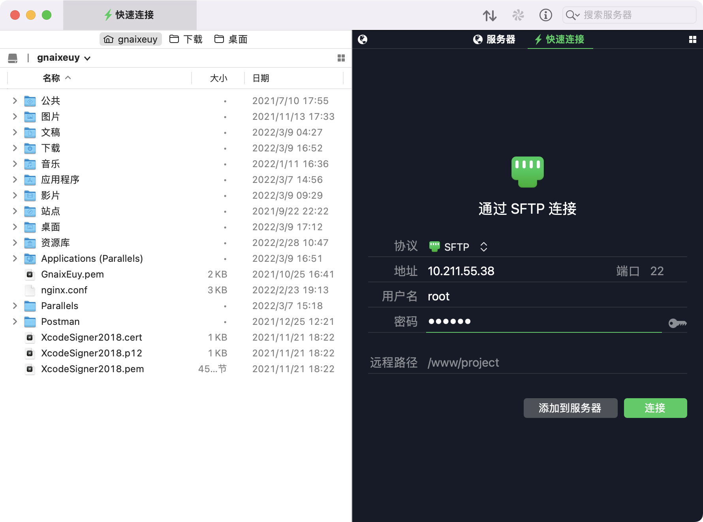
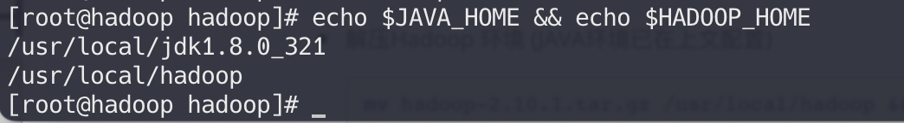
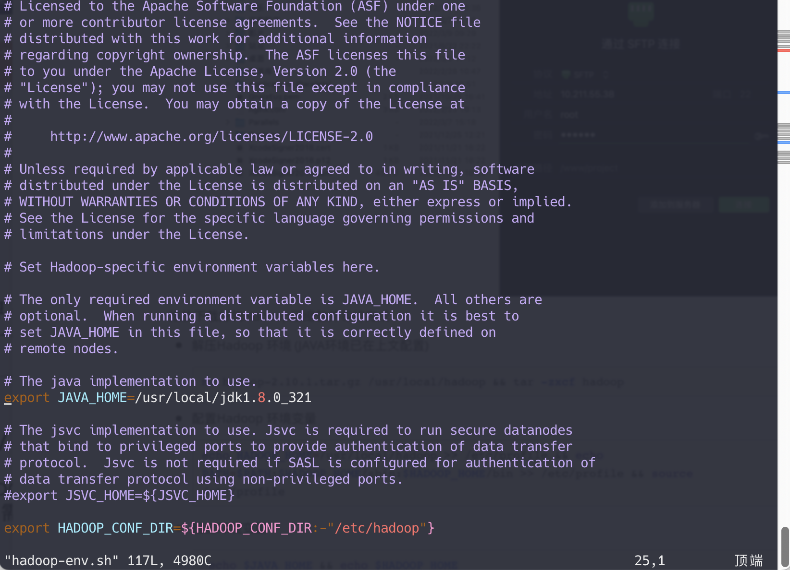
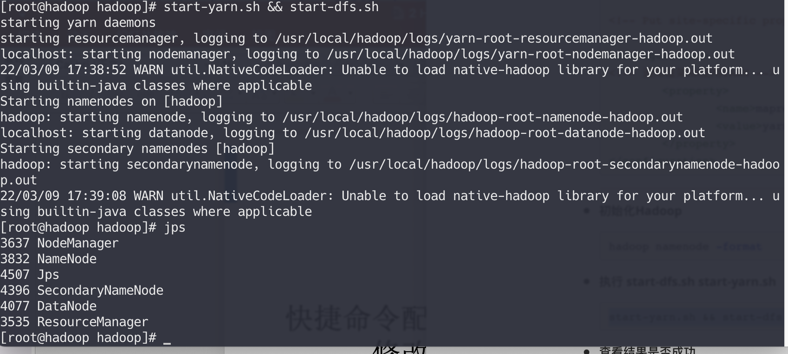
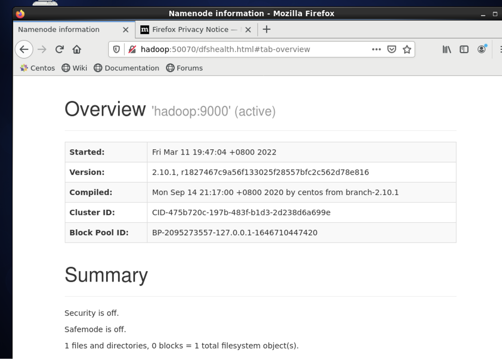

### Hadoop环境搭建

----

* 安装jdk1.8

  > 参考第一次作业 [安装部署centOS并配置jdk1.8](https://github.com/GnaixEuy/SharingSky-SE2019-20212/blob/main/大数据技术/第一次作业/12班操作需求及详情.md)

* 使用ftp 工具上传Hadoop压缩包或使用wget下载Hadoop

  * 使用ftp工具上传Hadoop

    

拖放下载好的Hadoop压缩包并等待完成

* 解压Hadoop 环境 (JAVA环境已在上文配置)

  ```shell
  mv hadoop-2.10.1.tar.gz /usr/local/hadoop && tar -zxcf hadoop 
  ```

* 配置Hadoop 环境变量

  ```shell
  echo HADOOP_HOME=/usr/local/hadoop >> /etc/profile && echo PATH=$PATH:$HADOOP_HOME/sbin:$HADOOP_HOME/bin >> /etc/profile && source /etc/profile
  ```

* 检查环境变量

  ```shell
   echo $JAVA_HOME && echo $HADOOP_HOME
  ```

  

---

* 修改Hadoop配置文件

  * 修改**hadoop-env.sh**

  * ```she
    cd /usr/local/hadoop/etc/hadoop/ && vim hadoop-env.sh



- 修改**core-site.xml**

  ```shell
  vim core-site.xml
  ```

  修改为

  ```xml
  <?xml version="1.0" encoding="UTF-8"?>
  <?xml-stylesheet type="text/xsl" href="configuration.xsl"?>
  <!--
    Licensed under the Apache License, Version 2.0 (the "License");
    you may not use this file except in compliance with the License.
    You may obtain a copy of the License at
  
      http://www.apache.org/licenses/LICENSE-2.0
  
    Unless required by applicable law or agreed to in writing, software
    distributed under the License is distributed on an "AS IS" BASIS,
    WITHOUT WARRANTIES OR CONDITIONS OF ANY KIND, either express or implied.
    See the License for the specific language governing permissions and
    limitations under the License. See accompanying LICENSE file.
  -->
  
  <!-- Put site-specific property overrides in this file. -->
  
  <configuration>
          <property>
                  <name>fs.defaultFS</name>
                  <value>hdfs://hadoop:9000</value>
                  <description>NameNode URI</description>
          </property>
  </configuration>
  ```

* 修改**hdfs-site.xml**

  ```shell
  vim hdfs-site.xml
  ```

  修改为

  ```xml
  <?xml version="1.0" encoding="UTF-8"?>
  <?xml-stylesheet type="text/xsl" href="configuration.xsl"?>
  <!--
    Licensed under the Apache License, Version 2.0 (the "License");
    you may not use this file except in compliance with the License.
    You may obtain a copy of the License at
  
      http://www.apache.org/licenses/LICENSE-2.0
  
    Unless required by applicable law or agreed to in writing, software
    distributed under the License is distributed on an "AS IS" BASIS,
    WITHOUT WARRANTIES OR CONDITIONS OF ANY KIND, either express or implied.
    See the License for the specific language governing permissions and
    limitations under the License. See accompanying LICENSE file.
  -->
  
  <!-- Put site-specific property overrides in this file. -->
  
  <configuration>
  <property>
          <name>dfs.datanode.data.dir</name>
          <value>file:///usr/local/hadoop/data/datanode</value>
    </property>
    <property>
       <name>dfs.namenode.name.dir</name>
          <value>file:///usr/local/hadoop/data/namenode</value>
    </property>
    <property>
          <name>dfs.namenode.http-address</name>
          <value>hadoop:50070</value>
    </property>
    <property>
       <name>dfs.namenode.secondary.http-address</name>
          <value>hadoop:50090</value>
    </property>
    <property> <!-- 设置hdfs副本数量 -->
          <name>dfs.replication</name>
          <value>1</value>
    </property>
    <property> <!-- 设置不做权限校验 -->
          <name>dfs.permissions</name>
          <value>false</value>
    </property>
  </configuration>
  ```

* 修改**yarn-site.xml**

  ```shell
  vim yarn-site.xml
  ```

  修改为

  ```xml
  <?xml version="1.0"?>
  <!--
    Licensed under the Apache License, Version 2.0 (the "License");
    you may not use this file except in compliance with the License.
    You may obtain a copy of the License at
  
      http://www.apache.org/licenses/LICENSE-2.0
  
    Unless required by applicable law or agreed to in writing, software
    distributed under the License is distributed on an "AS IS" BASIS,
    WITHOUT WARRANTIES OR CONDITIONS OF ANY KIND, either express or implied.
    See the License for the specific language governing permissions and
    limitations under the License. See accompanying LICENSE file.
  -->
  <configuration>
  
  <!-- Site specific YARN configuration properties -->
          <property>
  <!-- reducer取数据的方式是mapreduce_shuffle -->
                  <name>yarn.nodemanager.aux-services</name>
                  <value>mapreduce_shuffle</value>
          </property>
          <property>
                  <name>yarn.nodemanager.aux-services.mapreduce_shuffle.class</name>
                  <value>org.apache.hadoop.mapred.ShuffleHandler</value>
          </property>
          <property>
                  <name>yarn.resourcemanager.resource-tracker.address</name>
                  <value>hadoop:8025</value>
          </property>
          <property>
                  <name>yarn.resourcemanager.scheduler.address</name>
                  <value>hadoop:8030</value>
          </property>
          <property>
                  <name>yarn.resourcemanager.address</name>
                  <value>hadoop:8050</value>
          </property>
  
  </configuration>
  ```

* 修改**mapred-site.xml**

  ```she
  vim mapred-site.xml
  ```

  修改为

  ```xml
  [root@hadoop hadoop]# vim yarn-site.xml
  <?xml version="1.0"?>
  <?xml-stylesheet type="text/xsl" href="configuration.xsl"?>
  <!--
    Licensed under the Apache License, Version 2.0 (the "License");
    you may not use this file except in compliance with the License.
    You may obtain a copy of the License at
  
      http://www.apache.org/licenses/LICENSE-2.0
  
    Unless required by applicable law or agreed to in writing, software
    distributed under the License is distributed on an "AS IS" BASIS,
    WITHOUT WARRANTIES OR CONDITIONS OF ANY KIND, either express or implied.
    See the License for the specific language governing permissions and
    limitations under the License. See accompanying LICENSE file.
  -->
  
  <!-- Put site-specific property overrides in this file. -->
  
  <configuration>
  <!-- 通知框架MR使用YARN -->
          <property>
                  <name>mapreduce.framework.name</name>
                  <value>yarn</value>
          </property>
  </configuration>
  ```

  ----

* **初始化Hadoop**

  ```shell
  hadoop namenode -format
  ```

* **执行 start-dfs.sh start-yarn.sh**

  ``` shell
  start-yarn.sh && start-dfs.sh

* **查看结果是否成功**

  ```shell
  jps
  ```

  

访问 

```web
hadoop:50070
```

可见web页面