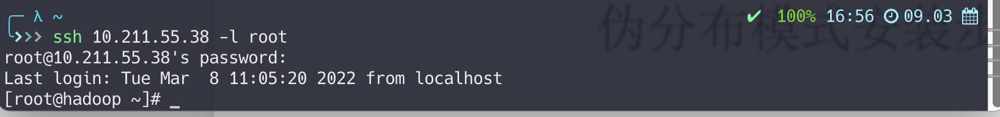
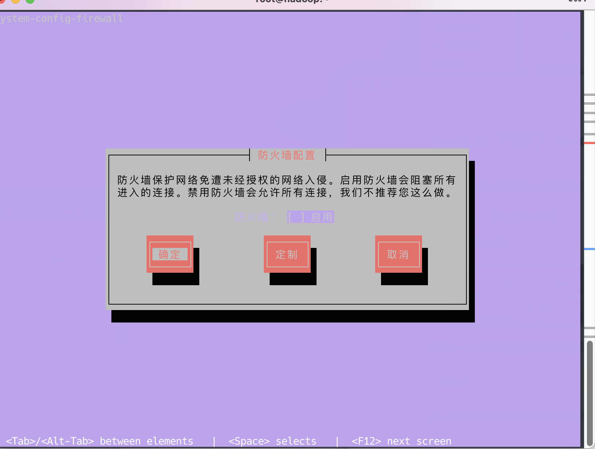

### centOS 下配置免密ssh

----

> #### 关闭防火墙和ssh自动登录:
>
> 非必要，简化启动流程

* ##### 关闭防火墙：

  

借助ssh工具链接虚拟机或在虚拟机内使用终端操作

``` shell
setup
```

进入图形化配置界面关闭防火墙



* #### 修改主机名：

  ```shell
  vim /etc/sysconfig/network
  ```

  将HOSTNAME改为hadoop

* #### 修改host映射:

  ```shell
  vim /etc/hosts
  ```

  添加hadoop 对本机的映射

* #### 设置ssh免密:

  ```shell
  vim /etc/selinux/config
  ```

  设置SELINUX为disabled

  执行

  ```shell
  ssh-keygen -t dsa && cd ~/.ssh && cat id_dsa.pub >> authorized_keys
  ```

  ssh localhost 测试即可

  ---

  

  

  