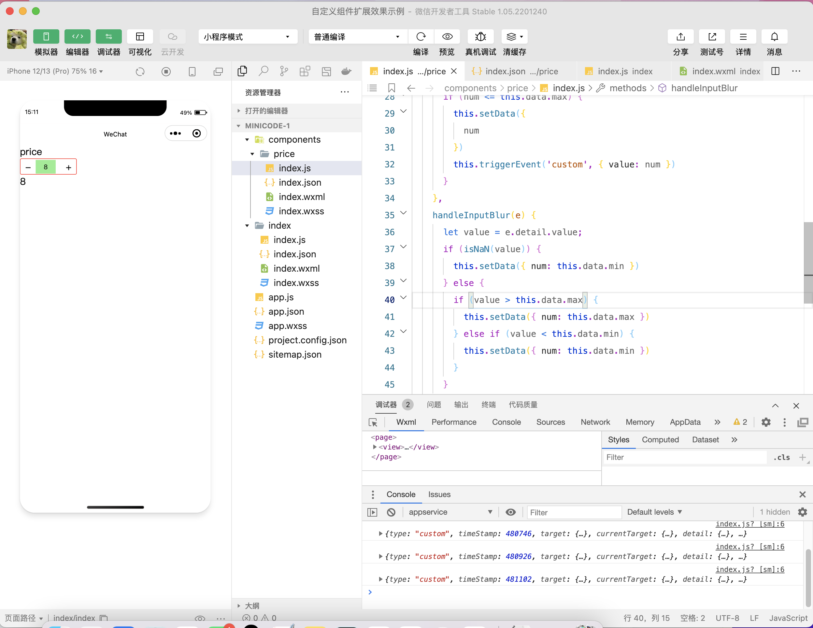

### 自定义组件

---

#### 自定义组件（实现价格增加组件），要求提交组件、调用页面源代码和实现效果截图。

> #### Componments/price文件夹下
>
> ---
>
> ##### index.js:
>
> ```javascript
> Component({
>   properties: {
>     num: {
>       type: Number,
>       value: 1
>     },
>     min: {
>       type: Number,
>       value: 0
>     },
>     max: {
>       type: Number,
>       value: 10
>     }
>   },
>   methods: {
>     minus() {
>       let num = this.data.num - 1;
>       if (num >= this.data.min) {
>         this.setData({
>           num
>         })
>         this.triggerEvent('custom', { value: num })
>       }
>     },
>     plus() {
>       let num = this.data.num + 1;
>       if (num <= this.data.max) {
>         this.setData({
>           num
>         })
>         this.triggerEvent('custom', { value: num })
>       }
>     },
>     handleInputBlur(e) {
>       let value = e.detail.value;
>       if (isNaN(value)) {
>         this.setData({ num: this.data.min })
>       } else {
>         if (value > this.data.max) {
>           this.setData({ num: this.data.max })
>         } else if (value < this.data.min) {
>           this.setData({ num: this.data.min })
>         }
>       }
>     }
>   }
> })
> ```
>
> ##### index.json:
>
> ````json
> {
>   "component": true,
>   "usingComponents": {}
> }
> ````
>
> ##### index.wxml:
>
> ```wxml
> <view class="price-container">
>   <view class="minus" bindtap="minus">
>       -
>   </view>
>   <view class="input-container">
>     <input type="number" class="input"      
>      value="{{num}}"  bindblur="handleInputBlur()" />
>   </view>
>   <view class="plus" bindtap="plus">
>       +
>   </view>
> </view>
> ```
>
> ##### index.wxss:
>
> ```wxss
> .price-container {
>   display: flex;
>   border: solid red 1px;
>   border-radius: 6rpx;
>   width: 220rpx;
> }
> 
> .minus,
> .plus {
>   height: 60rpx;
>   width: 60rpx;
>   display: flex;
>   justify-content: center;
>   align-items: center;
> }
> 
> .input-container {
>   height: 60rpx;
>   width: 100rpx;
>   display: flex;
>   align-items: center;
> }
> 
> .input {
>   width: 80rpx;
>   height: 54rpx;
>   text-align: center;
>   font-size: 26rpx;
>   background-color: lightgreen;
> }
> ```

> #### Page/index文件夹下
>
> ----
>
> ##### index.js:
>
> ```javascript
> Page({
>   data: {
>     price: 5
>   },
>   handlePageInputChange(e) {
>     console.log(e);
>     this.setData({
>       price: e.detail.value
>     })
>   }
> })
> ```
>
> ##### index.json:
>
> ```json
> {
>   "usingComponents": {
>     "price": "../components/price"
>   }
> }
> ```
>
> ##### index.wxss:
>
> ```wxss
> .intro {
>   margin: 30px;
>   text-align: center;
> }
> ```
>
> ##### index.wxml:
>
> ```wxml
> <view>
>   <text>price</text>
>   <price num="{{price}}" bindcustom="handlePageInputChange"></price>
>   <view>{{price}}</view>
> </view>
> ```

----

#### 截图效果：

