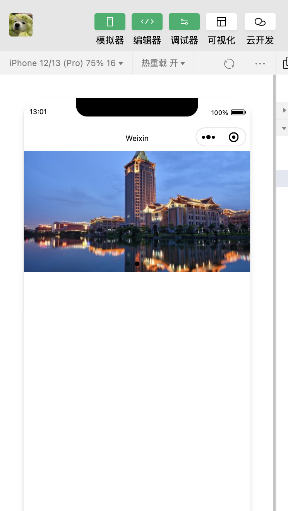

### 容器组件

----

#### 使用小程序实现轮播效果，写出wxml和wxss代码，并提交实现效果图：

Index.wxml

```wxml
<swiper class="swiper" indicator-dots="true" autoplay="true" interval="5000" duration="1000">  
   <block wx:for="{{movies}}" wx:for-index="index">  
    <swiper-item>  
     <image src="{{item.url}}" class="slide-image" mode="aspectFill"/>  
    </swiper-item>  
   </block>  
  </swiper>
```

Index.wxss

```wxss
/**index.wxss**/
.swiper {
 height: 400rpx;
 width: 100%;
}
.swiper image {
 height: 100%;
 width: 100%;
}
```

Index.js

```javascript
Page({
  data: {
    movies: [
      { url: 'https://blog.gnaixeuy.cn/wp-content/uploads/2021/04/cropped-%E5%8D%9A%E5%AE%A2logo123.png' },
      { url: 'https://blog.gnaixeuy.cn/wp-content/uploads/2021/07/srchttp-gss0.baidu_.com-vo3dSag_xI4khGko9WTAnF6hhy-zhidao-pic-item-37d3d539b6003af38f4149b8322ac65c1138b66b.jpgreferhttp-gss0.baidu_.comapp2002sizef999910000qa80n0g0nfmtjpeg-540x304.jpeg' },
      { url: 'https://blog.gnaixeuy.cn/wp-content/uploads/2022/01/image-540x304.jpeg' }
    ]
  },
  onLoad: function () {
  }
})
```

----

效果图

