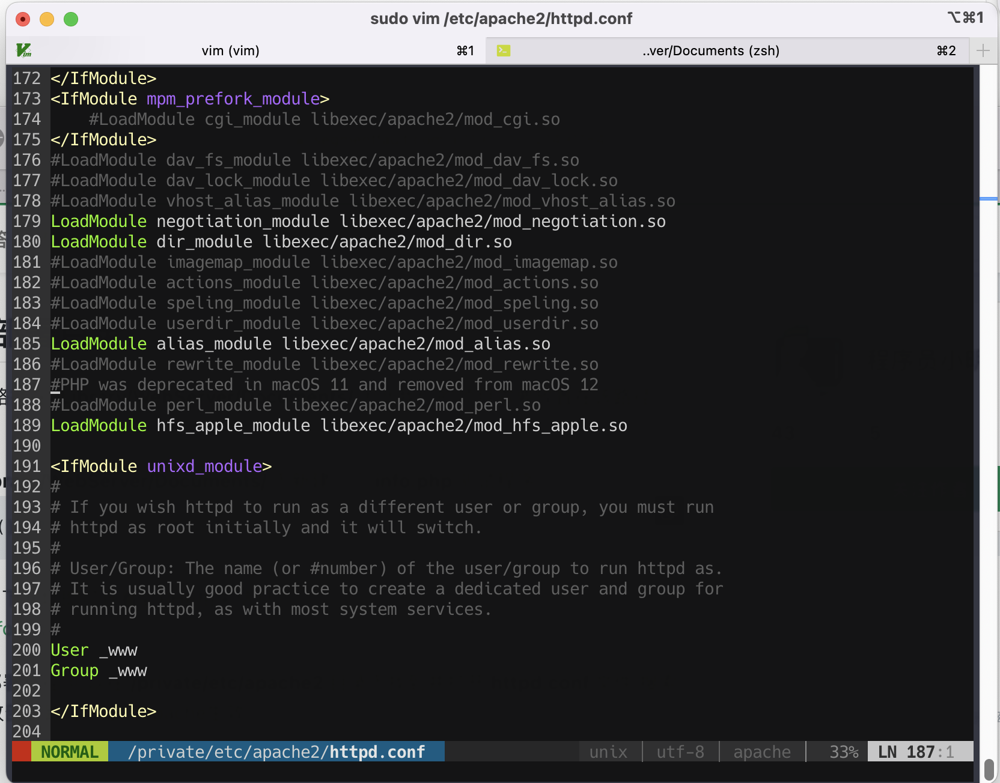

## 环境配置

----

#### PHP8.1:

在[brew](https://zhuanlan.zhihu.com/p/59805070)正确安装的前提下执行

```shell
brew install php
```

----

#### composer:

同理：

```shell
brew install composer
```

---

#### Apache:

MacOS 自带服务器，我们仅需启动即可


可见错误,执行

```shell
brew reinstall apr-util
```


再次启动可见报错，需要修改/usr/local/etc/httpd/httpd.conf里的配置参数

```shell
#方式一
#通过mdfind 找到要修改的文件
sudo vim /usr/local/etc/httpd/httpd.conf
#使用shift + G 定位到最后一行 i 插入模式
ServerName 127.0.0.1
#方式二 #直接输入如下命令
sudo vim /usr/local/etc/httpd/httpd.conf
```


正常启动

```shell
sudo apachectl start
```

---

修改ServerName过程中可见默认端口为8080访问即可见 Apachectl正常启动

---

#### 配置PHP

输入 

```shell
brew info php
```

可见安装信息，我们只需要在Apache的配置文件中添加Apache对php的支持就可以了，接下来交给我们的终端：
编辑http.conf配置文件

```shell
sudo vim /etc/apache2/httpd.conf
```



可见默认已不支持(笔者为macOS12  Monterey)，如果非改系统将此行的php模块解除注释即可


我们已经通过brew安装了PHP，其中默认的依赖环境都会同步安装好，观察刚才的配置文件，可见这里的部署目录为/usr/local/var/www/下

我们在该目录下插入一个info.php

``` php
<?php phpinfo(); ?>
```


 

可见访问到该文件但仍然没有解析PHP,返回最初的配置文件中加入

```shell
#复制brew 安装好的PHP模块
cp /usr/local/Cellar/php/8.1.3_1/lib/httpd/modules/libphp.so /usr/local/opt/httpd/lib/httpd/modules
```


```
LoadModule php_module lib/httpd/modules/libphp.so
AddType application/x-httpd-php .php
DirectoryIndex index.php index.htm index.html
```


```shell
#重启 Apache服务器
sudo apachectl restart
#确保 PHP服务启动
brew services start php && brew services list
```


可见配置成功

----

初始化thinkPHP

```shell
#切换镜像至Aliyun 你的节点牛逼当我没说可以不做这一步
composer config -g repo.packagist composer https://mirrors.aliyun.com/composer/
#加载thinkPHP框架到本地
 cd /usr/local/var/www/ && composer create-project topthink/think tp
```


构建成功

```shell
cd tp && php think run
```


启动成功