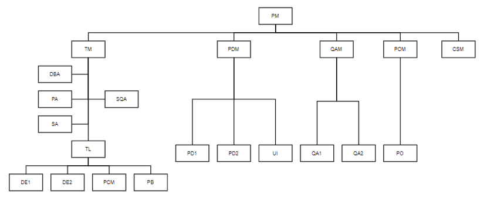

### 需求调研

---

####  1. 引言

 1. 编写目的

    > 就Keep这款APP而言，就算您没用过，应该也听说过，毕竟它盛名在外，因此分析并倒推Keep这款APP，对于细节的推敲和产品的考究其实很有益处。本文除试写Keep的PRD之外，也对Keep的一些产品细节作出思考，考虑或有不当，欢迎大家在以下评论区商讨，也欢迎大家提出其他思考点，在此以Keep的座右铭熬一鸡汤，以飨诸君——“哪有什么天生如此，只是我们天天坚持。”

 2. 调研背景

    > Keep是一款移动运动应用，为用户提供健身教学、跑步、骑、交友和健身饮食指导、装备购买等一站式运动解决方案。

 3. 专业术语

    > |    角色名    | 简称 |                             职责                             |
    > | :----------: | :--: | :----------------------------------------------------------: |
    > |   项目经理   |  PM  | 1.  负责整个项目的计划、执行、跟踪、发布。  2.  项目的最终决策人和负责人 |
    > |   技术经理   |  TM  | 1.  负责项目的代码开发管理，包括：预估开发工作量、开发任务分配、开发日报的发布、详细设计、代码BUG跟踪、发布前准备。  2.  在技术方面的最终负责人 |
    > | 产品设计经理 | PDM  | 1.  负责项目路的功能性需求与产品设计。  2.  产品功能设计与交互设计的最终负责人。  3.  项目DEMO演示时的主要参与者之一。 |
    > |   运营经理   | POM  | 1.  负责项目的非功能性需求，主要是运营、推广方面的设计与实施。  2.  项目DEMO演示时的主要参与者之一。 |
    > |   测试经理   | QAM  | 1.  负责项目的测试计划、测试任务分配、BUG跟踪。  2.  项目最终是否通过测试，是否可以上线的最终决策人。  3.  项目DEMO演示时的主要参与者之一。 |
    > |   客服经理   | CSM  | 1.  项目的来自于客户需求的管理者。  2.  项目DEMO演示时的主要参与者之一。 |
    > |   开发组长   |  TL  |           负责某一个开发小组的管理任务。受TM领导。           |
    > |    架构师    |  PA  |                   负责整体架构，代码审核。                   |
    > | 软件过程专员 | SQA  | 1.  负责监督项目的过程计划与执行情况。协助项目的规范化以及风险告警。  2.  仅协助TM，关注于开发过程的管理与执行。 |
    > |  开发工程师  |  DE  |          负责具体的设计、编码、测试。受TL或TM领导。          |
    > | 数据库管理员 | DBA  | 负责项目的数据库设计的审核、变更，SQL语句的审核，数据订正，测试或上DBA线数据准备。 |
    > |  系统管理员  |  SA  |           负责环境部署、维护:网站流量或压力监控。            |
    > |  界面设计师  |  UI  |                 负责用户界面设计与交互设计。                 |
    > |  产品运行师  |  PO  |                      负责产品的运营活动                      |
    > |  产品设计师  |  PD  |          负责需求的收集与分析，产品设计与交互设计。          |
    > |  测试工程师  |  QA  | 负责软件的集成测试，包括三个环境下的测试：测试环境、予发布环境、线上环境。 |
    > |  配置管理员  | PCM  |          负责本项目的分支管理，代码合并，版本控制。          |
    > |    发布员    |  PB  |        负责发布程序到:开发环境，测试环境，线上环境。         |

#### 2.概述

 1. 项目目标

    > 制作一款健身促进软件，完成对目标客户的业务覆盖,包括但不限于用户各项的运动数据记录，分析，以及报告呈现和建议等功能点，为用户提供一套完整的科学的健身计划规划

 2. 期待解决问题

    > 1、提高品牌知名度：Keep 鼓励用户形成运动习惯，运动直播将极大增强运动在
    > 线上和线下的娱乐互动特性。Keep 绝大多数的草根明星和KOL 不是职业运动员，
    > 他们的锻炼方式、参赛目的很接地气，内容充满乐趣，以草根明星和KOL 为个体
    > 进行的运动直播，能直接带来 Keep 作为平合的知名度。

    > 2、增加用户粘性：运动直播的好处就在于，用户能感受到高互动性、实时性、
    > 强参与感，会有很高的付费欲望。我们希望自己的直播内容粘性高、用户跟着反
    > 复看，而且不止是看，是边看边运动，给用户带来使用价值。
    > 所以，为了更加直观的为大家提供知识教学，我们的keep 健身直播主要是私教
    > 主播带领学员们训练用。而在线上，我们的教练也可以点名，可以示范动作，可
    > 以带节奏，可以和用户交流，而且对于用户来说，这是即时和免费的。

    > 3、增加自身盈利能力：当keep 的直播真的能够成为线上健身房之时，它就凭借
    > 着优质内容建立了竞争壁垒；而鉴于直播行业的火热，keep 健身直播的盈利，
    > 打是可以预期的。

 3. 项目范围

	1. 本系统所管理的业务范围包括：用户的各项运动记录，用户运动圈的社交属性。
	2. 本系统包括以下功能：运动内容记录，登录，分享运动记录。‘
	
 3. 双方约定

	 1. 不包含项目的运营管理
	 2. 不包含相关运营人员管理
	 3. 不包含附带商品销售系统管理
	

#### 3.相关资料

1. 组织结构

   

   2. 用户名单

      集美大学（含集美大学诚毅学院）在校师生

   3. 重要业务规则

      1. 用户需要登录才能使用各项功能
      2. 用户使用账号注销需要7天内不可登录
      3. 运动圈需要标注运动设备

#### 4.需求

1. 总经理：整个公司的运维。

2. 技术部：

   1. #### 项目经理

      1. 负责整个项目的计划、执行、跟踪、发布。
      2. 项目的最终决策人和负责人

   2. 技术经理

      1. 负责项目的代码开发管理，包括：预估开发工作量、开发任务分配、开发日报的发布、详细设计、代码BUG跟踪、发布前准备。
      2. 在技术方面的最终负责人
      3. 技术经理
         1. 负责项目的代码开发管理，包括：预估开发工作量、开发任务分配、开发日报的发布、详细设计、代码BUG跟踪、发布前准备。
         2. 在技术方面的最终负责人

   3. 产品设计经理

      1. 负责项目路的功能性需求与产品设计。
      2. 产品功能设计与交互设计的最终负责人。
      3. 项目DEMO演示时的主要参与者之一。

   4. 测试经理

      1. 负责项目的测试计划、测试任务分配、BUG跟踪。
      2. 项目最终是否通过测试，是否可以上线的最终决策人。
      3. 项目DEMO演示时的主要参与者之一。

   5. 开发组长

      1. 负责某一个开发小组的管理任务。受TM领导。

   6. 架构师

      1. 负责整体架构，代码审核。

   7. 软件过程专员

      1. 负责监督项目的过程计划与执行情况。协助项目的规范化以及风险告警。
      2. 仅协助TM，关注于开发过程的管理与执行。

   8. 开发工程师

      1. 负责具体的设计、编码、测试。受TL或TM领导。

   9. 数据库管理员

      1. 负责项目的数据库设计的审核、变更，SQL语句的审核，数据订正，测试或上DBA线数据准备。

   10. 系统管理员

       1. 负责环境部署、维护：网站流量或压力监控。

   11. 界面设计师

       1. 负责用户界面设计与交互设计。

   12. 产品运行师

       1. 负责产品的运营活动

   13. 产品设计师

       1. 负责需求的收集与分析，产品设计与交互设计。

   14. 测试工程师

       1. 负责软件的集成测试，包括三个环境下的测试：测试环境、予发布环境、线上环境。

   15. 配置管理员

       1. 负责本项目的分支管理，代码合并，版本控制。

   16. 发布员

       1. 负责发布程序到:开发环境，测试环境，线上环境。

3. 人事部

   1. 人员调度管理。

4. 财务部

   1. 对公司的财务管理。

5. 市场部

   1. 运营经理
      1. 负责项目的非功能性需求，主要是运营、推广方面的设计与实施。
      2. 项目DEMO演示时的主要参与者之一。
   2. 客服经理
      1. 项目的来自于客户需求的管理者。
      2. 项目DEMO演示时的主要参与者之一。

6. 客户需求

   1. 希望能简单快速的找到自己适合的运动
   2. 看中课程数量和内容
   3. 希望能有更多激励制度监督用户坚持运动
   4. 专业级的指导及运动知识

#### 5.数据

 	1. 运动模块
 	 	1. 运动类型
 	 	2. 卡路里
 	 	3. 时间
 	2. 用户模块
 	 	1. 年龄
 	 	2. 体重
 	 	3. 身高
 	 	4. 性别
 	 	5. 运动习惯
 	3. 社交模块
 	 	1. 用户名
 	 	2. 内容
 	 	3. 器械设备
 	 	4. 运动数据

#### 6.相关系统

>OAuth2.0 认证系统
>
>朋友圈分享系统

#### 7.其他

​	1. 开发周期(待协商)